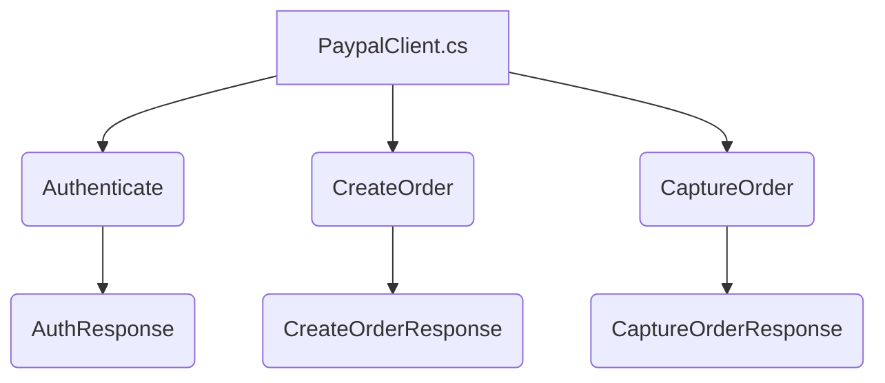

## Module: PaypalClient

**Primary Objectives**: The purpose of this module is to provide a Paypal client class that handles authentication and performs operations such as creating and capturing orders.

**Critical Functions**:
1. Authenticate(): This function authenticates the client by sending a request to the Paypal API and returns the authentication response.
2. CreateOrder(string value, string currency, string reference): This function creates an order with the specified value, currency, and reference.
3. CaptureOrder(string orderId): This function captures an order with the specified orderId.

**Key Variables**:
1. Mode: Represents the mode of the Paypal client (Live or Sandbox).
2. ClientId: Represents the client ID for authentication.
3. ClientSecret: Represents the client secret for authentication.
4. BaseUrl: Represents the base URL for the Paypal API.

**Interdependencies**: This module interacts with the Paypal API to authenticate the client and perform operations such as creating and capturing orders.

**Operational Sequence**: The operational sequence involves the following steps:
1. Authentication: The client authenticates itself by sending a request to the Paypal API.
2. Create Order: The client creates an order by sending a request with the specified value, currency, and reference.
3. Capture Order: The client captures an order by sending a request with the specified orderId.

**Performance Aspects**: Performance considerations include the network latency and response time of the Paypal API. The module also uses asynchronous methods to improve responsiveness.

**Reusability**: The PaypalClient class can be reused in different applications that require integration with Paypal for handling payments and orders.

**Usage**: This module can be used in an application that needs to interact with the Paypal API for creating and capturing orders.

**Assumptions**: This analysis assumes that the provided code module is part of a larger system/application and is used specifically for handling Paypal-related operations.
## Flow Diagram

